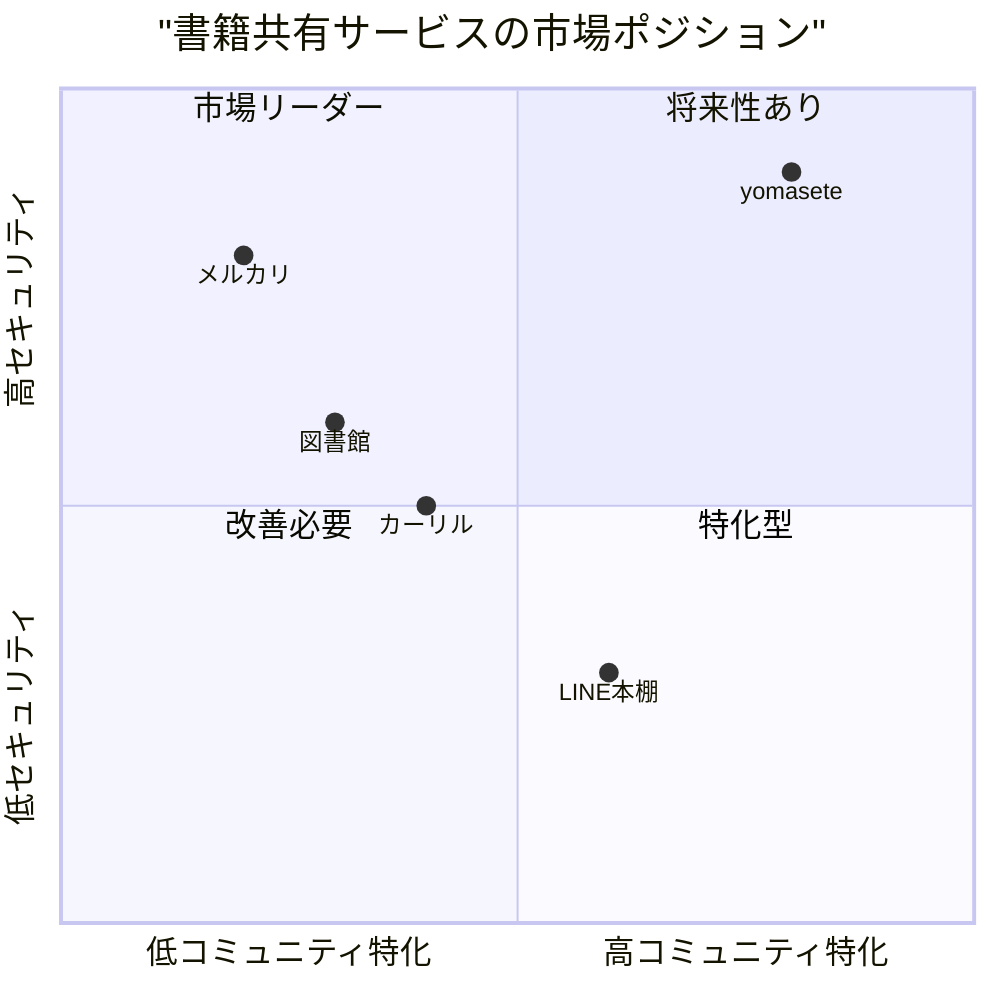
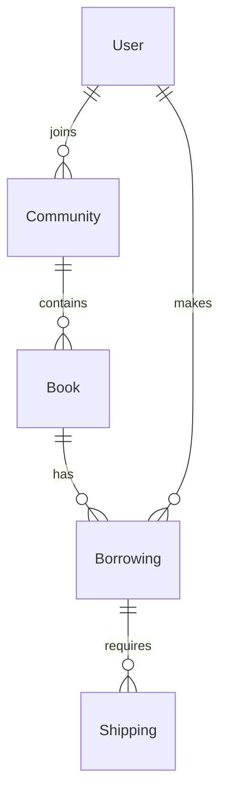

# yomasete - コミュニティ内書籍貸し借りサービス PRD

## エグゼクティブサマリー

本PRDは、コミュニティ内での書籍貸し借りを促進する「yomasete」サービスの詳細な製品要件を定義します。市場調査によると、デジタルプラットフォームを活用した書籍共有サービスは2024年に230億円規模に達し、年間5.6%の成長が見込まれています。特に日本市場では、プライバシー保護と安全な取引への需要が高く、ヤマト運輸の匿名配送サービス（市場シェア41%）との連携により、この課題に対応します。

### プロジェクト基本情報
- プロジェクト名: yomasete
- 開発スタック:
  - フロントエンド: pnpm, ReactRouter v7, TypeScript, radix-ui, vanilla-extract, Eslint
  - バックエンド: Supabase
  - Node管理: fnm (Node v22)

## 1. 市場分析と機会

### 1.1 市場トレンド

**デジタルトランスフォーメーション**
- 書籍管理のデジタル化が加速（2023年比13%増）
- モバイルファースト設計の重要性増大
- AIと連携した推薦システムの普及

**コミュニティフォーカス**
- 環境負荷低減への意識向上
- 地域コミュニティでの知識共有ニーズ拡大
- プライバシー保護への要求増加

### 1.2 ユーザーペイン
1. 書籍購入コストの増加
2. 保管スペースの限界
3. 一時的な利用ニーズへの対応不足
4. プライバシー保護への不安
5. 既存の貸し借りサービスの信頼性問題

## 2. 製品定義

### 2.1 製品ビジョン
「安全で持続可能な知識共有を通じて、コミュニティの絆を深める」

### 2.2 主要な差別化要因

1. **セキュアなプライバシー保護**
   - ヤマト運輸の匿名配送サービス完全統合
   - プライバシーファーストの設計思想

2. **コミュニティ最適化**
   - 最大5人までの無料プラン提供
   - コミュニティサイズに応じた柔軟な拡張

3. **シンプルな利用体験**
   - バーコードスキャンによる簡単登録
   - モバイルファーストのUI設計

### 2.3 主要機能とユースケース

#### コアユースケース
1. 書籍登録・管理
   ```
   As a 本の所有者
   I want 所有書籍を簡単に登録・管理したい
   So that コミュニティでシェアできる
   ```

2. 書籍借用
   ```
   As a 読書愛好家
   I want 必要な本を一時的に借りたい
   So that 購入コストを抑えられる
   ```

3. 匿名配送
   ```
   As a プライバシー重視のユーザー
   I want 個人情報を開示せず本を送受信したい
   So that 安心して取引できる
   ```

### 2.4 競合分析

#### 主要競合サービス比較

| 機能 | yomasete | メルカリ | カーリル | LINE本棚 |
|------|-----------|---------|----------|----------|
| 貸借特化 | ✓ | × | × | × |
| コミュニティ制限 | ✓ | × | × | △ |
| 匿名配送 | ✓ | ✓ | × | × |
| バーコード登録 | ✓ | ✓ | × | × |
| 無料プラン | ✓ | × | ✓ | ✓ |



## 3. 技術要件

### 3.1 システムアーキテクチャ

1. **フロントエンド**
   - TypeScript + React
   - ReactRouter v7による高度なルーティング
   - radix-uiによるアクセシブルなコンポーネント
   - vanilla-extractによるスケーラブルなスタイリング

2. **バックエンド (Supabase)**
   - PostgreSQLデータベース
   - リアルタイムサブスクリプション
   - Row Level Securityによるデータ保護
   - ストレージソリューション

### 3.2 データモデル



### 3.3 API設計

#### RESTful エンドポイント
1. ユーザー管理
   - POST /auth/signup
   - POST /auth/login
   - GET /users/profile

2. コミュニティ管理
   - POST /communities
   - GET /communities/:id
   - PUT /communities/:id

3. 書籍管理
   - POST /books
   - GET /books/:id
   - PUT /books/:id/status

4. 配送管理
   - POST /shipping/anonymous
   - GET /shipping/:id/status

### 3.4 セキュリティ要件

1. **認証・認可**
   - JWTベースの認証
   - Role-based access control
   - Multi-factor authentication (オプション)

2. **データ保護**
   - エンドツーエンド暗号化
   - 個人情報の匿名化
   - GDPR/個人情報保護法準拠

## 4. 実装フェーズ

### Phase 1: MVP（2ヶ月）
- 基本的なユーザー認証
- コミュニティ作成・参加
- 書籍登録（バーコード）
- 基本的な貸借フロー

### Phase 2: 配送連携（1ヶ月）
- ヤマト運輸API連携
- 匿名配送フロー
- 配送状態追跡

### Phase 3: 決済・収益化（1ヶ月）
- 有料プラン実装
- 決済システム連携
- アナリティクス基盤

## 5. 成功指標（KPI）

1. **ユーザー獲得**
   - 月間アクティブユーザー（MAU）
   - コミュニティ作成数
   - ユーザー継続率

2. **取引活性**
   - 月間貸借取引数
   - 平均貸出期間
   - 返却率

3. **収益性**
   - 有料プラン転換率
   - 月間収益（MRR）
   - ユーザーあたり収益（ARPU）

## 6. リスクと対策

1. **プライバシーリスク**
   - 対策: 徹底した個人情報保護とデータ暗号化
   - モニタリング: セキュリティ監査の定期実施

2. **配送トラブル**
   - 対策: 明確な責任範囲の規定
   - モニタリング: 配送状態の自動追跡

3. **コミュニティ活性化**
   - 対策: エンゲージメント促進機能の実装
   - モニタリング: コミュニティ活動指標の測定

## 7. 今後の展望

1. **機能拡張**
   - AIレコメンデーション
   - 読書グループ機能
   - 電子書籍対応

2. **市場拡大**
   - 法人向けプラン
   - 国際展開
   - API公開

## 8. 結論

yomaseteは、既存の書籍シェアリングサービスの課題を解決し、プライバシーを重視したコミュニティベースの新しい形の知識共有プラットフォームを提供します。市場調査から見える成長性と、実装技術の選定による堅牢性を備え、持続可能なサービス展開が期待できます。
